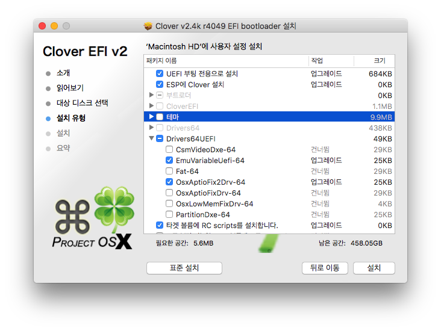
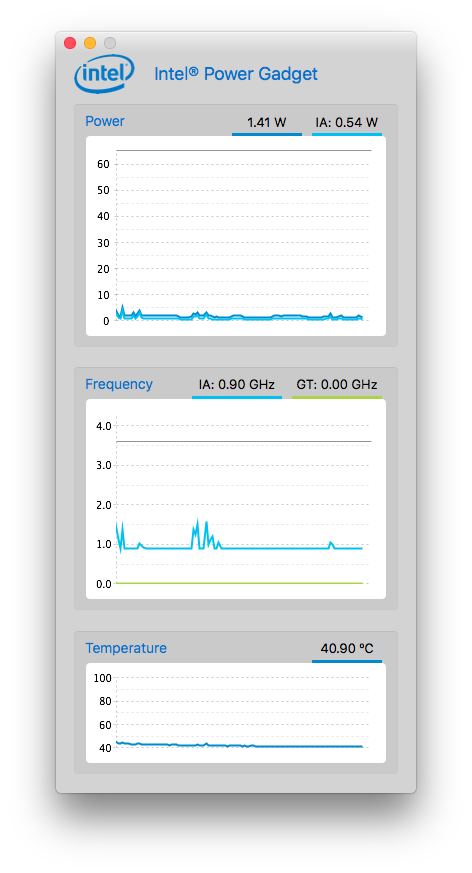
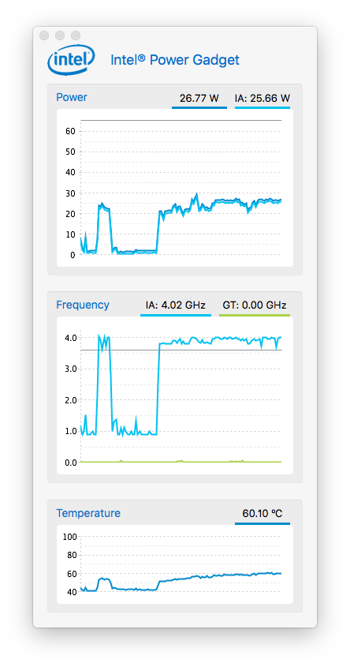
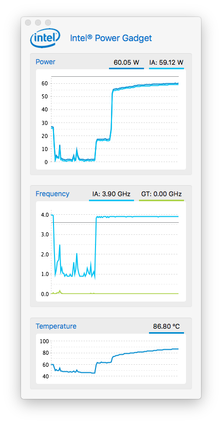
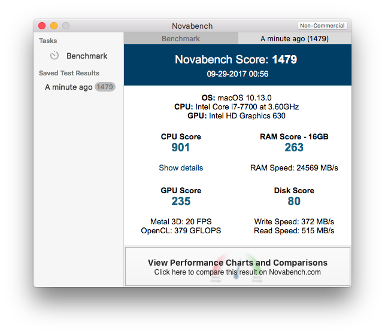
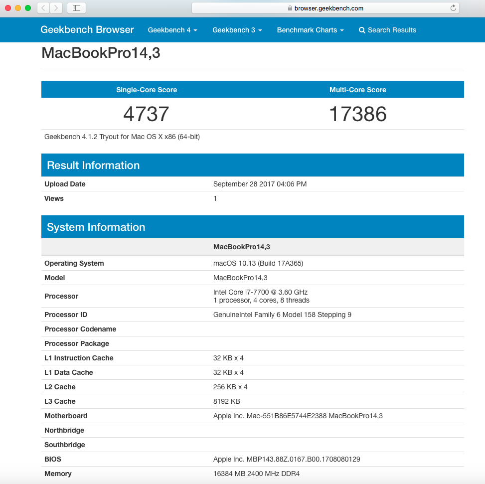

**Specification**
1. CPU : Intel Core I7-7700
2. RAM : 16GB 2400MHz DDR4
3. VGA : Dual (Optimus)
   1. Intel HD 630
   2. ~~Nvidia GTX 1050~~ : Disabled
4. Sound : Realtek ALC269VC
5. Storage : ~~SM961 M.2 SSD 256GB~~ Samsung 840pro 256GB
6. WLAN : ~~NGFF(M.2) Intel AC3168~~ BCM94352Z NGFF
7. LAN : Realtek PCIe GBE Family

**Installation**

**CPU SpeedStep**

Idle

Normal load

Full load

**Benchmarks**

**Credits**
- Rehabman (https://github.com/RehabMan)
  - config.plist, SSDT hotpatches, ACPIBatteryManager, Backlight Injector, Broadcom Bluetooth, USBInjectAll, VoodooPS2Controller, FakeSMC fork, a lot of base knowlege about Hackintosh
- Pike R. Alpha (https://pikeralpha.wordpress.com)
  - Kernel patch for HWP
- vit9696 (https://github.com/vit9696)
  - Lilu, AppleALC
- lvs1974 (https://sourceforge.net/u/lvs1974/profile/)
  - IntelGraphicsFixup, BT4LEContinuityFixup, AirportBrcmFixup
- PMHeart (https://github.com/PMheart)
  - CpuFriend, CoreDisplayFixup
- Mieze (https://github.com/Mieze)
  - RealtekRTL8111
- Kozlek (https://github.com/kozlek/HWSensors)
  - FakeSMC
- syscl (https://github.com/syscl/XPS9350-macOS/tree/master/DSDT/patches)
  - A couple of DSDT patches
- Clover EFI bootloader (https://sourceforge.net/projects/cloverefiboot/)
